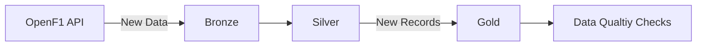
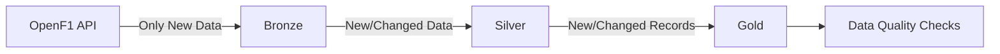

# f1-data-lakehouse

Initially I wanted to create a data warehouse. However since I'm preparing of the Databricks Data Engineering Associate Exam I decided to might as well use the community edition version of the platform. This meant that I had to change my idea from creating a data warehouse to a data lakehouse as Databricks is the pioneer behind the broze/silver/medallion architecture that is very characteristic of a data lakehouse.

Next, I was having trouble deciding what data I even wanted to load. Then I realised that the ponly f1 data api I could find, the openf1api, only captures data from 2023 ownwards and the old f1 data data endpoint from "ergast f1 api' covered the sport's data starting from 1950 before retiring in 2024.

Hence I thought it be interesting to merge the historical data from ergast with newly incremental data from openf1api in my lakehouse. Hence this lakehouse will allow me to the full range of f1 data across the  allowing me to query and compare race behaviour.


## Table of Contents 
- Data Sources
- Overview of Project
- Challenges 
- Future Improvements
- Tech Stack


## Data Sources:

**Historical Data**
Since the ergast api for f1 data between 1950 to 2024 retired in 2024, I used a kaggle dataset which contained all the data from ergast.
The link to this dataset: https://www.kaggle.com/datasets/rohanrao/formula-1-world-championship-1950-2020

**Current Data**
Whereas for the current data I used the openf1 apis from : https://openf1.org
The data from this api returns 2023-current. Sicne there's an overlap with ergast for 2023 and 2024, I filtered it to only get data from 2025 ownwards


## Overview of Project:

**Phase 1: Historical Backfill**

```mermaid
flowchart LR
  HD["Historical Dataset (1950–2024)"] --> BR["Bronze"]
  OF["OpenF1 API (2023–)"] --> BR
  BR --> S["Silver"]
  S --> G["Gold"]
  G-->DQ['Data Quality Checks"]
```
For the first phase of the project, I ingested the historical Kaggle/Ergast-derived F1 dataset and OpenF1 API data up to the latest race. I first loaded the raw data as-is into the Landing layer and then into the Bronze layer.

From the Bronze layer, I transformed the data into the Silver layer by inspecting the Bronze tables, standardising column names, filtering OpenF1 API data to 2025 onwards to prevent overlap with the historical Kaggle dataset, and standardising OpenF1 identifiers to key to align with the project's conventions. The transformed data was then saved to the Silver layer.

Moving on to the Gold layer, I created data marts using Kimball-style dimensional modelling. I first created dimension tables for F1 teams, drivers, circuits, and meetings. These dimension tables were created first so that their keys could be used in the corresponding fact tables.
Since the project integrates data from two different sources, a key challenge was determining which columns to retain from each dataset and harmonising the column names and values between the two sources.

For the teams, drivers, and circuits dimension tables, I used the Kaggle dataset as the base and identified values from the corresponding OpenF1 tables that were not already present. After normalising values that used different naming conventions, only completely new values from OpenF1 were added, extending the original dataset. The IDs for these newly added records were also extended by continuously incrementing from the maximum ID in the original Kaggle table.
The meetings dimension table required a different approach. Each row represents a unique meeting within a season and year. Therefore, the Kaggle and OpenF1 meeting data had to be concatenated and ordered by date. I retained both source primary keys and added a surrogate meeting key to harmonise the entire dimension table.

I then created fact tables for race results, qualifying, sprint results, and pit stops. In general, I merged the corresponding Kaggle and OpenF1 tables and then joined the team, driver, and meeting dimension keys to create the fact tables.
Finally, the fact and dimension tables were passed through data quality checks to validate data completeness, uniqueness, and referential integrity.
At the end of Phase 1, the baseline Bronze, Silver, and Gold layer tables were in place.

**Phase 2: Ongoing Updates**



For subsequent updates, new data is sourced exclusively from the OpenF1 API. I duplicated the Bronze and Silver transformation scripts so that they process only the incoming OpenF1 data, while the Gold-layer scripts were developed separately to handle the integration of new records into the existing Gold tables.

The incoming data is first normalised to match the conventions of the existing Gold tables. It is then left anti-joined against the current Gold tables to identify records that do not already exist. Only these new records are then merged into the existing Gold tables.

The updated fact and dimension tables subsequently go through the same data quality checks to ensure that all validation criteria are met.

This process is orchestrated using Lakeflow Jobs, which are scheduled to run at the end of every month. CI/CD with GitHub Actions is also implemented to automate the deployment of changes to the notebooks and project file structure, ensuring that updates committed to the repository are reflected in the Databricks environment used by the Lakeflow Jobs.


## Challenges: 

1. **Data Integration**:
The process was very iterative, as I would sometimes discover while creating the fact tables that there were names that were repeated across both datasets but used different naming conventions. This required me to revisit the dimension tables and further normalise the values before continuing with the fact table transformations.

2. **Pipeline Runtime**:
One limitation of the current process is that the OpenF1 API reloads the data in full, resulting in each Lakeflow Job taking up to approximately 40 minutes to run. This limitation and potential solutions are discussed further in the Future Improvements section.

3.**Lakeflow Jobs**:
Individual notebooks could run successfully in isolation but encountered issues when executed as part of the overall job. This required checking dependencies between notebooks, execution order, permissions, and the configuration of the job itself. I also had to verify that changes deployed through GitHub Actions were correctly reflected when the scheduled Lakeflow Job ran.


## Future Improvements
**1. Move towards Incremental Ingestion**



The new data loaded has to be based on the data stored in the landing tables during the previous run, rather than reloading the entire dataset. This could be achieved by using a timestamp or watermark to track the latest data that has already been ingested, or by maintaining an ingestion state. The same incremental approach could then be applied to the Silver layer so that only new or changed Bronze records are processed, reducing unnecessary data processing across the pipeline.


**2. Add unit tests**

Refactor the data quality checks notebook into testable functions and add unit tests for the validation logic. These tests can then be incorporated into the CI/CD process to automatically validate changes before deployment.

**3. Monitoring**

Implement monitoring to track the number of new rows added to each Gold table during every pipeline run and alert when unexpected changes occur.

**4. Better Documentation**

Given the iterative nature of data integration, I should have maintained better documentation to capture the even the smallest of decsions and transformation logic and screenshots of those decisions. These small decisions usually inform the bigger ones.
   

## Tech Stack
- Databricks
- PySpark
- Github Actions
  


  


